# WdAsst 
> (Word Assistant - 帮助记忆和测试单词的GUI程序)

## Introduction
> 简要介绍

WdAsst (Word Assistant) 主要被设计为可以帮助记忆和测试单词的GUI程序，程序的功能主要有：
- 单词查询
  - 联网查询
  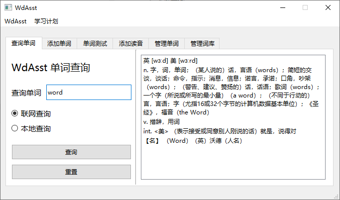
  - 本地查询
  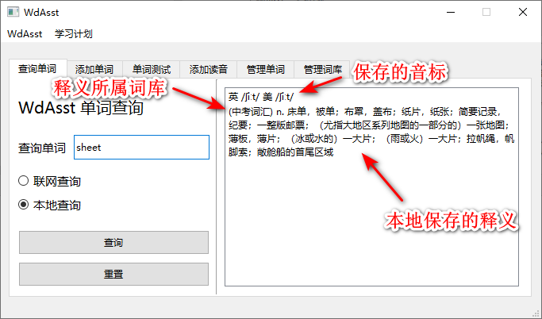
- 添加单词 （本地）
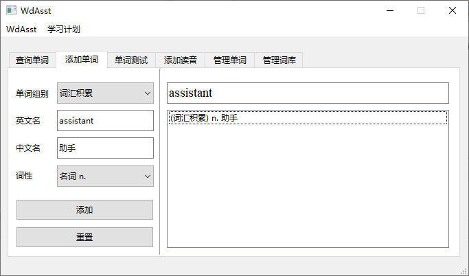
- 单词测试
  - 根据释义输入单词 （用户添加词库）
  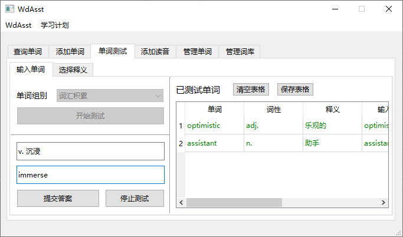
  - 根据单词选择释义 （系统标准词库）
  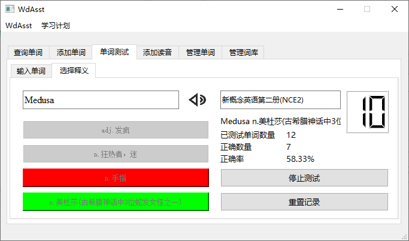
- 添加音标 （本地）
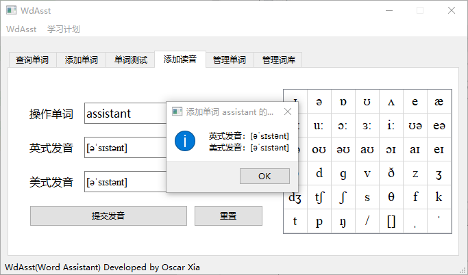
- 管理单词
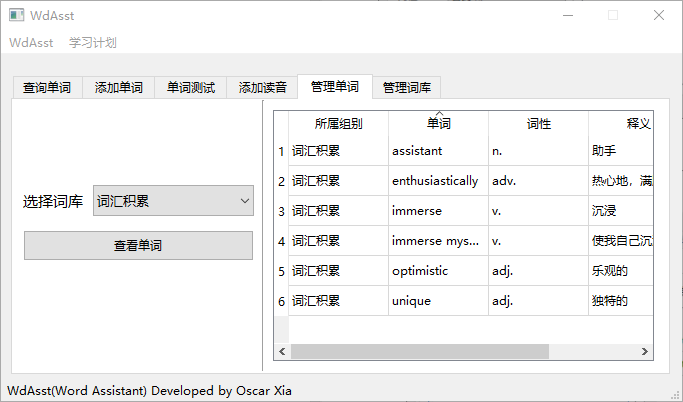
- 管理词库
  - 添加词库
  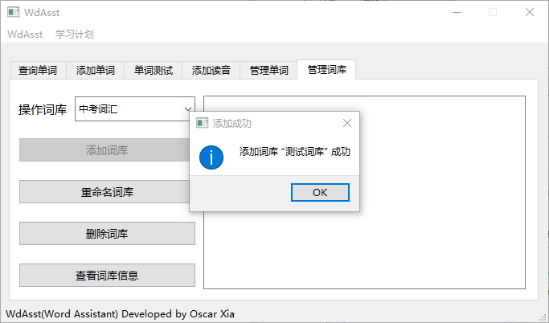
  - 重命名词库
  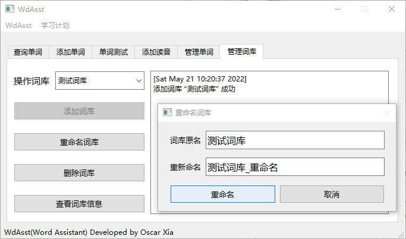
  - 删除词库
  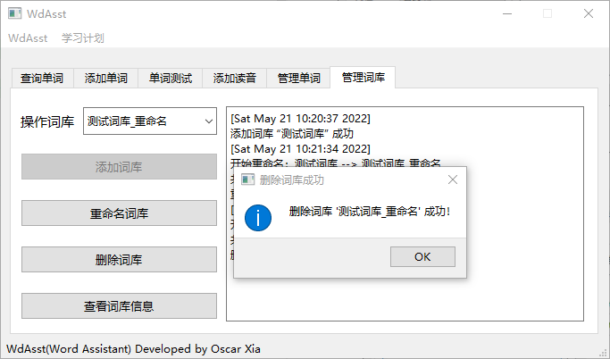
  - 查看词库信息
  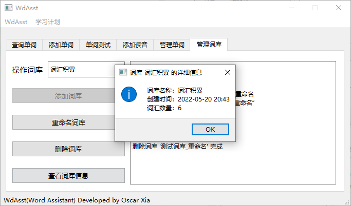

## Programming Language & Libraries
> 使用的编程语言和库文件

- python （主要语言）
- pyqt5 （GUI 程序）
- sqlite3 （数据库操作）
- xlwt （测试表格操作）
- 其他系统库 （读取文件，比较字符串等）